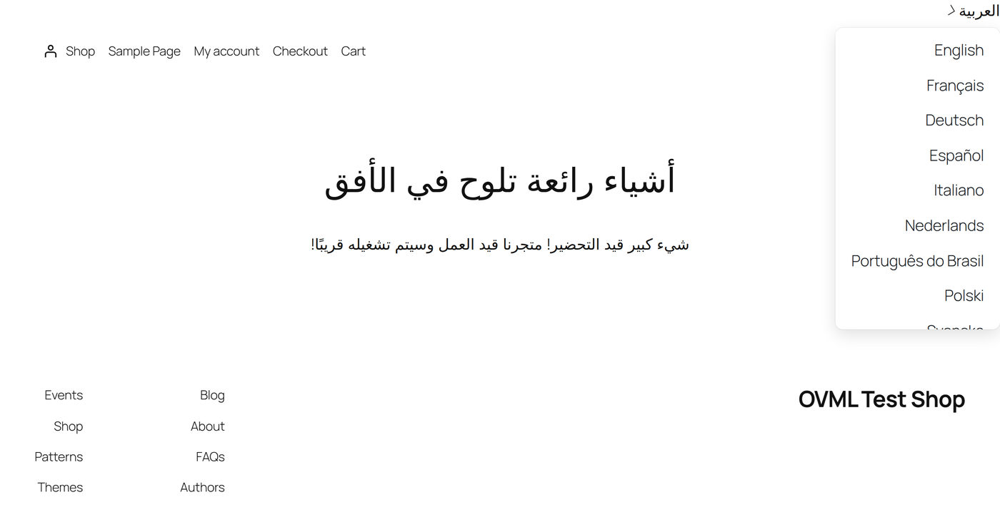
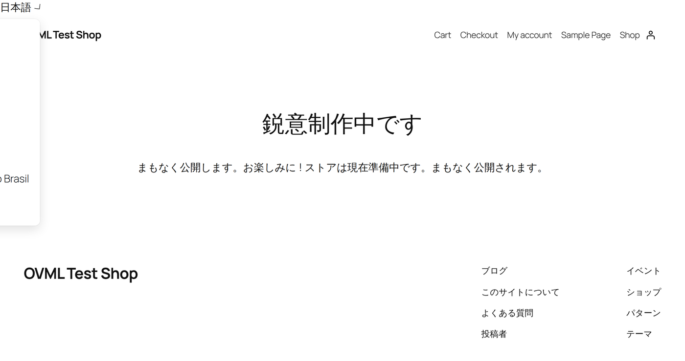
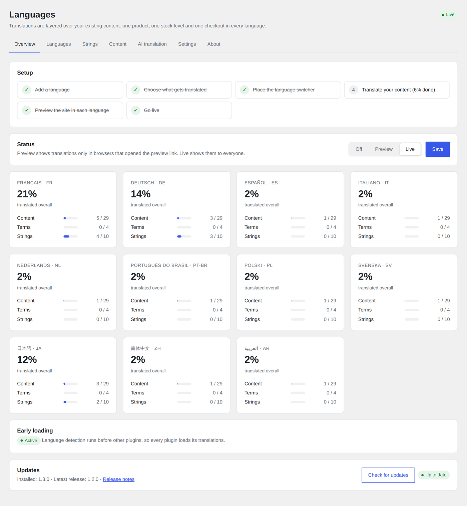
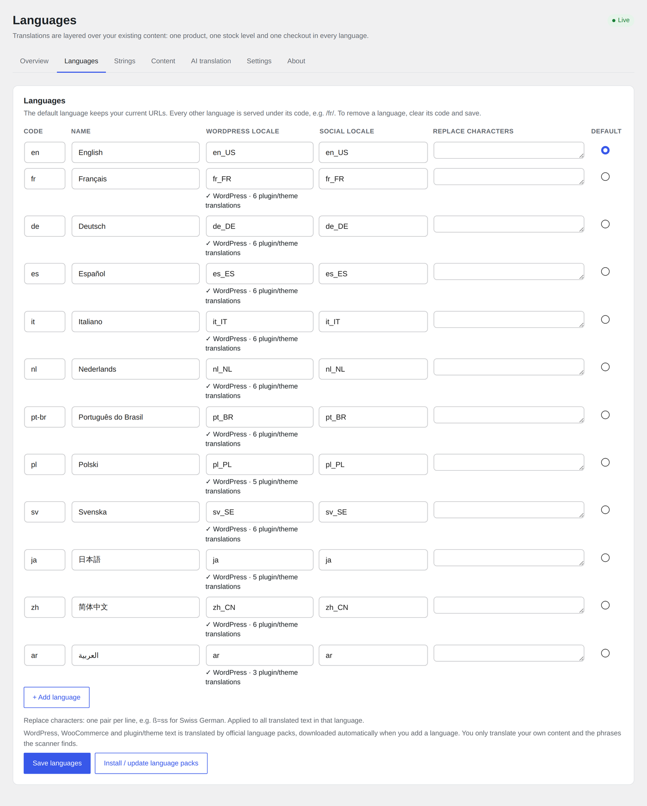
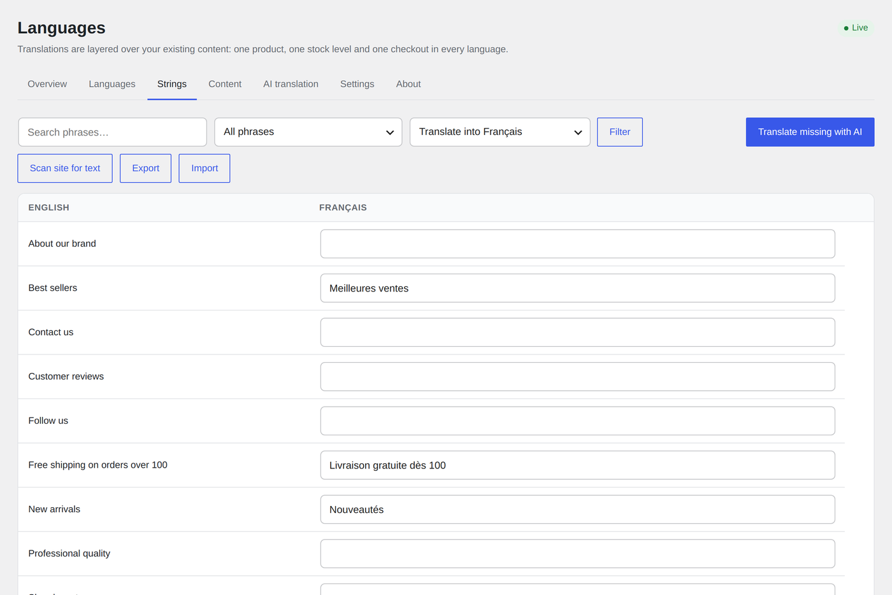
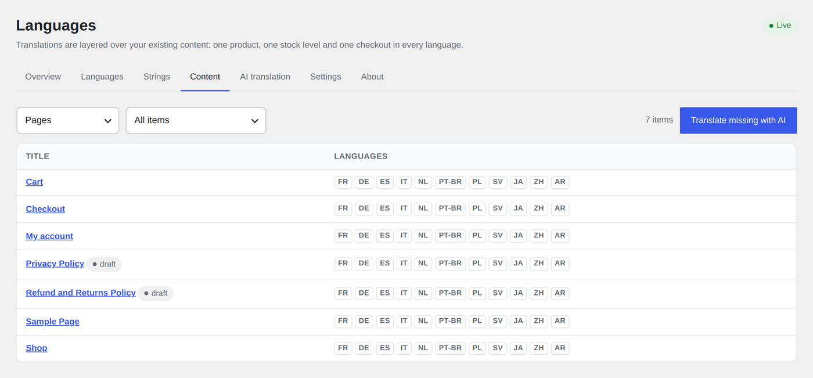
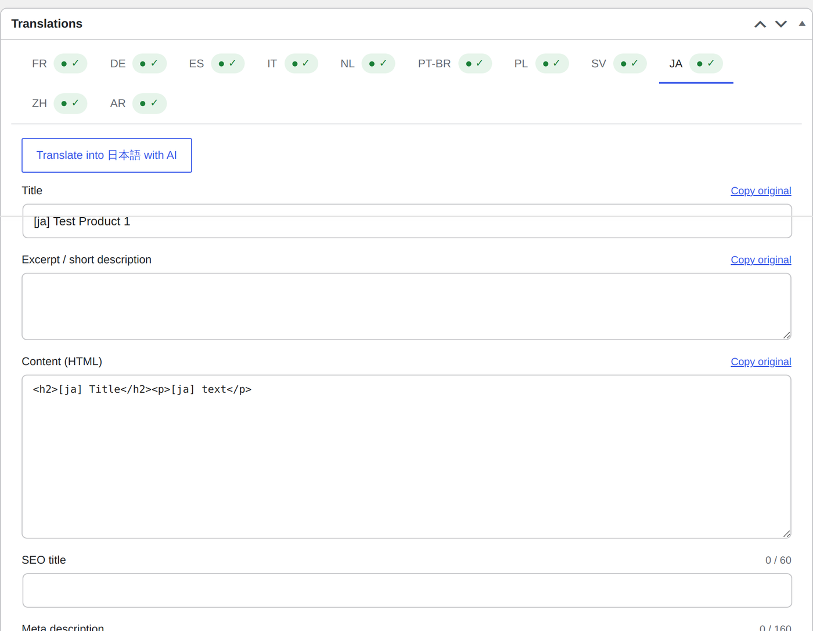
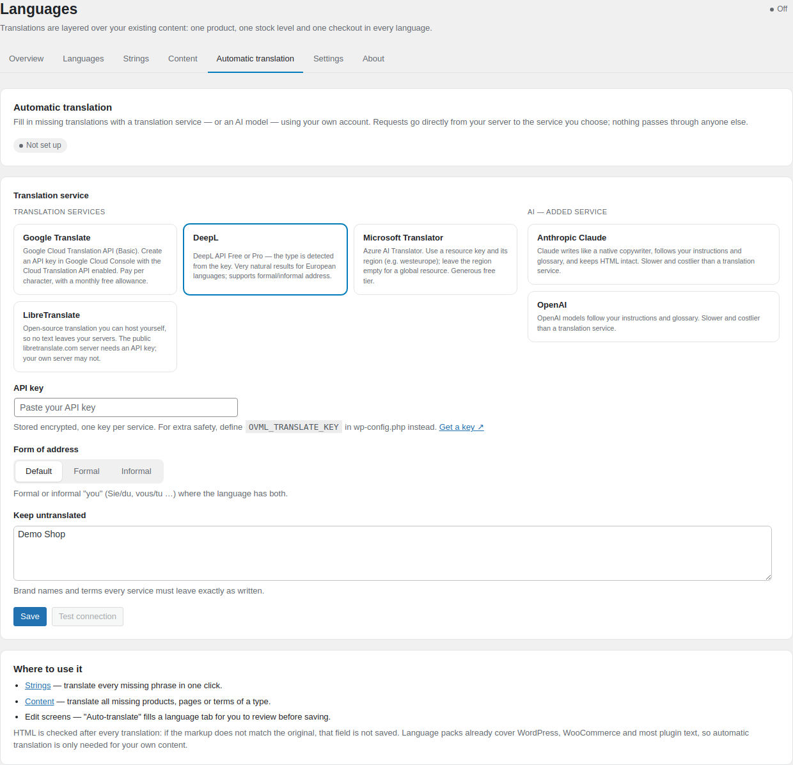
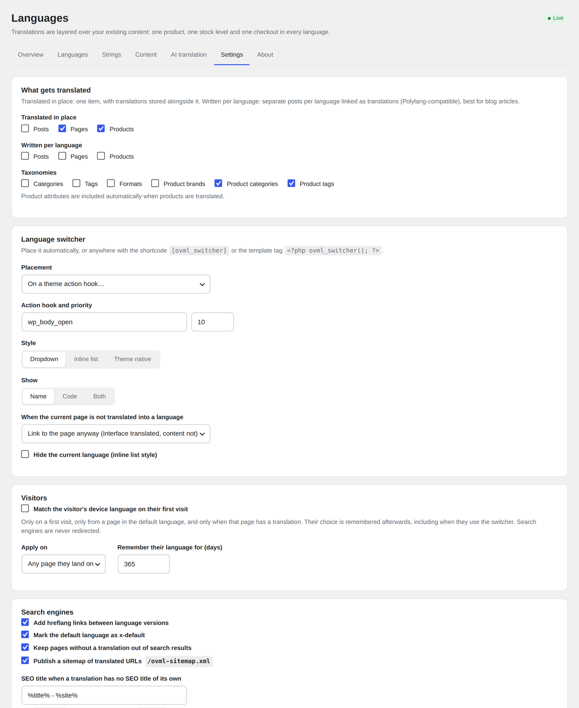

# Overlay Multilingual

Make a WordPress or WooCommerce site multilingual **without duplicating content**. Translations are layered over your existing posts, pages, products and terms, so a product stays one product — one stock level, one price, one order flow — in every language.

- `/fr/`, `/de/`… language URLs; the default language keeps its URLs
- WordPress, WooCommerce and theme text through official language packs
- Per-item translations (title, content, excerpt, SEO title/description) on every edit screen
- Phrase dictionary with a site scanner for theme, page-builder and menu text
- Optional "written per language" mode for blog posts (Polylang-compatible data)
- WooCommerce: translated storefront, orders remember their language, customer emails in it
- SEO: hreflang + x-default, html lang, noindex for untranslated pages, language sitemap, Rank Math and Yoast integration
- Off / Preview / Live rollout, optional first-visit device-language detection
- Language switcher: shortcode, template tag or any theme hook; dropdown, inline or theme-native
- Automatic translation with your own Google Translate, DeepL, Microsoft Translator or LibreTranslate account — or Claude / OpenAI as an added AI service — test connection, one-click bulk translation, "keep untranslated" terms, HTML verified
- Official language packs downloaded automatically for core, WooCommerce, plugins and themes — you only translate your own text
- Scales to many languages: per-language sitemaps, language picker in the phrase editor, compact status chips
- WP-CLI import/export, filters throughout, no external services, no tracking, no ads

## Screenshots

| | |
|---|---|
|  |  |
| **Storefront, Arabic (RTL)** — switcher lists every language in its own name | **Storefront, Japanese** — cart and gallery text from auto-installed language packs |
|  |  |
| **Overview** — setup checklist, Off / Preview / Live, coverage per language, updates | **Languages** — add any WordPress locale; language packs download automatically |
|  |  |
| **Strings** — phrases found by the scanner; one language at a time; translate missing with AI | **Content** — per-language status chips; bulk translate with AI |
|  |  |
| **Edit screens** — a tab per language, "Copy original", "Auto-translate" | **Automatic translation** — Google, DeepL, Microsoft, LibreTranslate, or Claude / OpenAI |
|  | |
| **Settings** — what gets translated, switcher placement and style, visitors, SEO, WooCommerce | |

See `readme.txt` for details. License: GPL-2.0-or-later.
